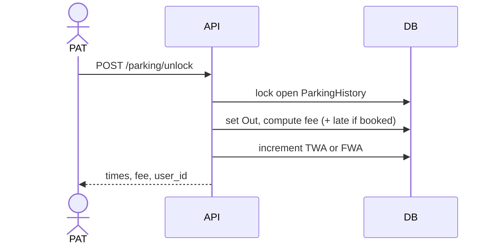

# Parking Lot Management System

## High-Level Design (HLD) and Low-Level Design (LLD)

Production-oriented design for a Django REST application that helps the Parking Assistance Team (PAT) manage multi-level parking and lets customers check availability, pre-book, cancel, and pay on checkout.

---

## 1. Problem summary

The parking facility has multiple levels. Every level has the same total number of slots. Slots are split into two categories: two-wheeler (TW) and four-wheeler (FW). PAT assigns customers to available lots. Customers see only counts (or yes/no availability), never lot numbers.

### 1.1 Actors

| Actor | Role in system | Access |
| --- | --- | --- |
| PAT | `ADMIN` | Full slot inventory, available counts per category/level, lock/unlock lots, fee on unlock |
| Customer | `PUBLIC` | Availability only (not lot numbers), pre-book a timeslot, cancel before the slot starts, checkout (unlock) of their own vehicle |

### 1.2 Functional features

1. PAT can view available slot counts on each floor, per category.
2. PAT can view every parking space, occupied or free.
3. PAT can lock the closest available lot for a vehicle on a given level and category (earliest floor first when level is omitted).
4. Unlocking a lot calculates and returns the parking fee.
5. Customers can see only whether (or how many) spaces are available per level/category — never lot numbers.
6. Customers can pre-book a timeslot; the closest free lot of the chosen category is allotted at booking time (earliest floor first).
7. Customers can cancel a booking before the timeslot starts.
8. Checkout after the booked timeslot adds a late fee.

### 1.3 Required APIs (from the statement)

| # | Intent | Method | Who |
| --- | --- | --- | --- |
| 1 | Available spaces per category per level | `GET` | `ADMIN`: counts. `PUBLIC`: available / not available |
| 2 | Assign / lock a parking space | `POST` | PAT (`ADMIN`) walk-in lock |
| 3 | Unlock a parking space and generate fee | `POST` | PAT (`ADMIN`); owner (`PUBLIC`) for their vehicle |

Pre-book and cancel are required features and are specified as additional authenticated APIs in LLD.

---

## 2. Design principles

- **Security first.** Every API is authenticated except health. Authorization is role-based. Secrets never live in code. Lot numbers are never returned to `PUBLIC` on availability APIs.
- **Least privilege.** Customers cannot enumerate lots, lock arbitrary lots, or unlock another customer’s vehicle.
- **Consistency.** Lock/unlock/book/cancel run in database transactions with row locks so two requests cannot take the same lot.
- **Auditability.** Every occupancy change is an append-only `ParkingHistory` row. Fees are stored with the history row, not computed only in the client.
- **Django ORM only** for data access (no raw SQL from request input).
- **Fill earlier floors first.** Allocation is deterministic: lowest level with a free slot of that category, then the closest slot on that floor. No random assignment. Slots are not reshuffled after allotment.

---

## 3. High-Level Design (HLD)

### 3.1 Architecture

```text
                    +------------------+
                    |  Clients         |
                    |  PAT console     |
                    |  Customer app    |
                    +--------+---------+
                             | HTTPS + JWT
                             v
                    +------------------+
                    |  API Gateway /   |
                    |  Reverse proxy   |
                    |  TLS, rate limit |
                    +--------+---------+
                             |
                             v
                    +------------------+
                    |  Django / DRF    |
                    |  AuthN / AuthZ   |
                    |  Parking / Book  |
                    +--------+---------+
                             |
              +--------------+--------------+
              v                             v
     +----------------+            +----------------+
     | PostgreSQL     |            | Redis          |
     | source of truth|            | rate limit,    |
     |                |            | JWT blacklist  |
     +----------------+            +----------------+
```

Single Django service for v1. PostgreSQL is the system of record. Redis is used for rate limiting and token revocation, not as a second source of occupancy truth.

### 3.2 Tech stack

| Layer | Choice | Why |
| --- | --- | --- |
| Language | Python 3.12+ | Current CPython LTS line |
| Framework | Django 5 + Django REST Framework | Auth, ORM, admin, validation |
| Auth | JWT (access + refresh), Argon2 passwords | Stateless API + revocable refresh |
| Database | PostgreSQL 16 | Transactions, `SELECT FOR UPDATE`, constraints |
| Cache | Redis | Throttle + refresh-token denylist |
| Proxy | Nginx / equivalent | TLS termination, request size limits |
| Config | Environment variables / secret manager | No secrets in git |

### 3.3 Logical modules

| Django app | Responsibility |
| --- | --- |
| `config` | Settings, URLs, middleware, exception handlers |
| `accounts` | User, roles, register/login/logout/refresh |
| `parking` | Levels, slots, availability, lock, unlock, fees |
| `bookings` | Pre-book, cancel, timeslot overlap, late fee flag |

### 3.4 Request flow (HLD)

1. Client sends HTTPS request with `Authorization: Bearer <access_token>` except for login/register/health.
2. Reverse proxy enforces TLS, body size, and IP rate limits.
3. Django authenticates the JWT, loads `role`.
4. Permission class allows or denies the endpoint.
5. Serializer validates and normalizes input (vehicle number, category, level, timeslot).
6. Service layer runs the occupancy algorithm inside `transaction.atomic()`.
7. Response is shaped by role: `ADMIN` gets counts and lot numbers; `PUBLIC` availability responses never include lot numbers.

### 3.5 Security architecture (HLD)

| Control | Design |
| --- | --- |
| Transport | TLS 1.2+ only. HSTS at the proxy. |
| Authentication | JWT access (short TTL) + refresh (longer TTL, rotatable). |
| Passwords | Django Argon2 hasher. Never store plaintext. Never log passwords. |
| Authorization | `IsAuthenticated` + role permissions (`IsAdminRole`, `IsPublicRole`, object-level owner checks). |
| Data leak prevention | Availability for `PUBLIC` returns booleans or “available/unavailable”, never lot IDs. |
| Injection | ORM + DRF serializers. No string-built SQL. |
| Abuse | Per-user and per-IP throttles on login, lock, book, cancel. |
| Secrets | `SECRET_KEY`, DB, Redis, JWT signing key from env. |
| Audit | Structured logs with `user_id`, action, lot, vehicle (masked), no tokens. |

### 3.6 Availability vs occupancy (HLD)

Two layers of truth:

1. **`ParkingSpace`** — denormalized counters per level (`TWA`, `FWA`) for fast availability reads.
2. **`ParkingHistory` + `ParkingSlot`** — the real occupancy. A lot is free only if every history row for that lot has both `In` and `Out`, and no active booking covers “now” (walk-in) or the requested timeslot (pre-book).

Counters are updated in the same transaction as history. If they ever drift, an admin reconciliation job can recompute them from history + bookings.

### 3.7 Locking rule (from the statement)

Before assigning a lot:

- The lot must exist for that level and category.
- For **all** `ParkingHistory` rows of that lot number, both `In` and `Out` must be present.
- If any row has `Out = NULL`, the lot is occupied and must not be assigned.

Walk-in lock creates a new `ParkingHistory` row with `In = now`, `Out = NULL`, `Fee = NULL`, and decrements `TWA` or `FWA`.

Unlock sets `Out`, computes `Fee`, and increments the matching counter.

### 3.8 Slot allocation (earliest floor, closest lot)

The original problem statement used random allotment. **Product rule for this system:** always fill **earlier floors first**, then give the **closest available slot at the moment of the request**.

| Request | How a lot is chosen |
| --- | --- |
| Customer pre-book (no level, or level omitted) | Scan levels `1..N`. Use the **lowest level** that still has a free slot of that category for the requested timeslot. On that level, pick the slot with the **smallest distance from the floor entry** (elevator / ramp). |
| PAT lock with `parking_level` | Stay on the requested level (PAT is directing a vehicle there). Pick the **closest free slot on that level**. If that level is full, return `409 LEVEL_FULL` — do not silently send the vehicle to another floor. |
| PAT lock without `parking_level` | Same as customer: earliest floor, then closest slot. |

**“Closest at that time” means a snapshot.** The allotted lot is the best free slot when the book/lock transaction commits. If a nearer slot later becomes free, the customer **keeps** the original lot. They can cancel (before the timeslot) and book again if they want a new snapshot.

**“Closest” is physical order on the floor**, not driving-time GPS. Each `ParkingSlot` has `distance_from_entry` (integer, lower = nearer to the entry/elevator). Seed uses sequence `001` as nearest. Tie-break: `lot_number` ascending.

Example: Level 1 FW slots `1-FW-001` (closest) and `1-FW-002` are free; Level 2 has `2-FW-001` free. A four-wheeler booking with no level gets `1-FW-001`. After that is taken, the next booking gets `1-FW-002`, not Level 2.

---

## 4. Low-Level Design (LLD)

### 4.1 Assumptions (explicit)

The problem statement does not specify rates, slot counts, or lot numbering. These production defaults are used unless product overrides them via config:

| Item | Default |
| --- | --- |
| Levels | Configurable (`PARKING_LEVEL_COUNT`) |
| Slots per level | Same on every level (`SLOTS_PER_LEVEL`) |
| Mix per level | Configurable TW/FW split that sums to `SLOTS_PER_LEVEL` |
| Lot number format | `{level}-{TW\|FW}-{seq:03d}` e.g. `2-TW-014`. `seq` is distance from that floor’s entry (`001` = closest). |
| Allocation | Earliest free floor, then lowest `distance_from_entry`. Deterministic. No random. No rebalancing after allotment. |
| Vehicle number | Uppercased, stripped, charset `[A-Z0-9-]` , length 4–15 |
| Walk-in fee | Hourly rate by category, billed in completed minutes, minimum 1 hour |
| Late fee | Extra per-hour (or fraction) after booked `end_at` |
| Booking window | Start must be in the future; max horizon e.g. 7 days; min duration 30 minutes |
| Cancel | Allowed only when `now < booking.start_at` |
| JWT | Access 15 minutes, refresh 7 days, rotation on use |
| One open stay | A vehicle may have at most one open history row (`Out IS NULL`) |

### 4.2 Entity-relationship model

Required tables from the statement are kept. Production needs slot inventory and bookings as well.

```mermaid
erDiagram
    User ||--o{ ParkingHistory : records
    User ||--o{ Booking : places
    ParkingSpace ||--|{ ParkingSlot : contains
    ParkingSlot ||--o{ ParkingHistory : occupancy
    ParkingSlot ||--o{ Booking : reserved
    FeePolicy ||--o{ ParkingHistory : prices

    User {
        uuid id PK
        string name
        string password_hash
        string role
        datetime created_at
        boolean is_active
    }

    ParkingSpace {
        uuid id PK
        int level UK
        int twa
        int fwa
        int tw_capacity
        int fw_capacity
    }

    ParkingSlot {
        uuid id PK
        uuid parking_space_id FK
        int level
        string category
        string lot_number UK
        int distance_from_entry
        boolean is_active
    }

    ParkingHistory {
        uuid id PK
        int level
        string type
        string vehicle_number
        string lot
        datetime in_at
        datetime out_at
        decimal fee
        uuid user_id FK
        uuid booking_id FK
    }

    Booking {
        uuid id PK
        uuid user_id FK
        uuid slot_id FK
        string vehicle_number
        string category
        int level
        string lot
        datetime start_at
        datetime end_at
        string status
    }

    FeePolicy {
        uuid id PK
        string category
        decimal hourly_rate
        decimal late_hourly_rate
        datetime effective_from
    }
```



### 4.3 Table specifications

#### 4.3.1 `User` (required)

| Column | Type | Constraints | Notes |
| --- | --- | --- | --- |
| `id` | UUID | PK | UUIDv4 |
| `name` | varchar(150) | NOT NULL | Display name |
| `email` | citext | UNIQUE, NOT NULL | Login identifier (production addition) |
| `password` | varchar | NOT NULL | Argon2 hash via Django hasher |
| `role` | varchar(16) | NOT NULL, CHECK `ADMIN` \| `PUBLIC` | PAT vs customer |
| `is_active` | boolean | NOT NULL default true | Disable without delete |
| `created_at` | timestamptz | NOT NULL | |

Django `AbstractBaseUser` (or `AbstractUser` with a `role` field) is acceptable. Password field is the Django password hash, never reversible encryption.

#### 4.3.2 `ParkingSpace` (required)

One row per level. Counters are **available** slots, not capacity.

| Column | Type | Constraints | Notes |
| --- | --- | --- | --- |
| `id` | UUID | PK | |
| `level` | int | UNIQUE, `> 0` | Floor number |
| `twa` | int | `>= 0` | Two-wheeler available |
| `fwa` | int | `>= 0` | Four-wheeler available |
| `tw_capacity` | int | `> 0` | Production: total TW slots on level |
| `fw_capacity` | int | `> 0` | Production: total FW slots on level |

Invariants: `twa <= tw_capacity`, `fwa <= fw_capacity`. Capacity columns are required so PAT can show occupied = capacity − available without scanning history.

#### 4.3.3 `ParkingSlot` (production; implied by “lot number”)

| Column | Type | Constraints | Notes |
| --- | --- | --- | --- |
| `id` | UUID | PK | |
| `parking_space_id` | UUID | FK `ParkingSpace` | |
| `level` | int | NOT NULL | Denormalized for query speed |
| `category` | varchar(2) | `TW` \| `FW` | |
| `lot_number` | varchar(32) | UNIQUE | Assigned to vehicles |
| `distance_from_entry` | int | `>= 1`, unique per `(level, category)` | Lower = closer to elevator/entry. Used for “closest slot”. |
| `is_active` | boolean | default true | Soft-disable a damaged slot |

Seeded once per level so every level has the same TW count and the same FW count. `distance_from_entry` equals the sequence in the lot number (`1-TW-001` → `1`).

#### 4.3.4 `ParkingHistory` (required)

| Column | Type | Constraints | Notes |
| --- | --- | --- | --- |
| `id` | UUID | PK | |
| `level` | int | NOT NULL | |
| `type` | varchar(2) | `TW` \| `FW` | |
| `vehicle_number` | varchar(15) | NOT NULL | Normalized |
| `lot` | varchar(32) | NOT NULL, FK-like to `ParkingSlot.lot_number` | |
| `in_at` | timestamptz | NOT NULL | Locking time |
| `out_at` | timestamptz | NULL | Unlocking time |
| `fee` | numeric(10,2) | NULL until unlock | |
| `user_id` | UUID | FK `User` | Actor who locked or booking owner |
| `booking_id` | UUID | FK `Booking`, NULL | Walk-in vs pre-book |

Partial unique index: at most one open stay per lot:

```sql
CREATE UNIQUE INDEX parkinghistory_open_lot
  ON parking_history (lot)
  WHERE out_at IS NULL;
```

Partial unique index: at most one open stay per vehicle:

```sql
CREATE UNIQUE INDEX parkinghistory_open_vehicle
  ON parking_history (vehicle_number)
  WHERE out_at IS NULL;
```

#### 4.3.5 `Booking` (features 6–8)

| Column | Type | Constraints | Notes |
| --- | --- | --- | --- |
| `id` | UUID | PK | |
| `user_id` | UUID | FK `User` | Owner |
| `slot_id` | UUID | FK `ParkingSlot` | |
| `vehicle_number` | varchar(15) | NOT NULL | |
| `category` | varchar(2) | `TW` \| `FW` | |
| `level` | int | NOT NULL | |
| `lot` | varchar(32) | NOT NULL | Allotted lot (customer may see this **after** booking, not on availability) |
| `start_at` | timestamptz | NOT NULL | |
| `end_at` | timestamptz | NOT NULL, `> start_at` | |
| `status` | varchar(16) | `CONFIRMED` \| `CANCELLED` \| `CONSUMED` \| `NO_SHOW` | |

Exclusion / overlap: application-level check inside a transaction (see 4.6). Optional PostgreSQL `tstzrange` + `EXCLUDE` constraint if the team enables `btree_gist`.

#### 4.3.6 `FeePolicy`

| Column | Type | Notes |
| --- | --- | --- |
| `category` | `TW` / `FW` | |
| `hourly_rate` | numeric | Base parking |
| `late_hourly_rate` | numeric | After booked end |
| `currency` | char(3) | e.g. `INR` |
| `effective_from` | timestamptz | Latest row wins |

### 4.4 Django models (shape)

```python
class UserRole(models.TextChoices):
    ADMIN = "ADMIN"
    PUBLIC = "PUBLIC"

class VehicleType(models.TextChoices):
    TW = "TW"
    FW = "FW"
```

Services never update `ParkingSpace.twa` / `fwa` without locking the `ParkingSpace` row (`select_for_update`).

### 4.5 API design (LLD)

Base path: `/api/v1/`

All responses: JSON. Errors: RFC 7807-style or DRF default with a stable `code`.

#### 4.5.1 Auth

| Method | Path | Auth | Purpose |
| --- | --- | --- | --- |
| `POST` | `/auth/register` | None (throttled) | Create `PUBLIC` user. `ADMIN` created by superuser / bootstrap only |
| `POST` | `/auth/login` | None (throttled) | Email + password → access + refresh |
| `POST` | `/auth/refresh` | Refresh token | Rotate refresh, new access |
| `POST` | `/auth/logout` | Authenticated | Denylist refresh token |

**Register — security**

- Role is **not** accepted from the client. Always `PUBLIC`.
- Password: min 12 chars, not identical to email/name; hashed with Argon2.
- Generic error on duplicate email to reduce enumeration where possible; login always returns the same message for bad credentials.

#### 4.5.2 GET availability (requirement API 1)

`GET /api/v1/parking/availability`

- Auth: required (`ADMIN` or `PUBLIC`)
- Input: none (optional query `level` to filter)
- Side effects: none

**ADMIN response** — counts per level and category:

```json
{
  "levels": [
    { "level": 1, "two_wheeler_available": 12, "four_wheeler_available": 8 },
    { "level": 2, "two_wheeler_available": 0, "four_wheeler_available": 5 }
  ]
}
```

**PUBLIC response** — availability only, no counts, no lots:

```json
{
  "levels": [
    { "level": 1, "two_wheeler_available": true, "four_wheeler_available": true },
    { "level": 2, "two_wheeler_available": false, "four_wheeler_available": true }
  ]
}
```

`true` iff counter `> 0`. Public users cannot infer exact remaining capacity.

#### 4.5.3 GET all spaces (feature 2, PAT only)

`GET /api/v1/parking/spaces`

- Auth: `ADMIN` only
- Returns every slot: level, category, lot number, occupancy (`OCCUPIED` if open history exists, else `FREE`), current vehicle if occupied.

`PUBLIC` receives `403`.

#### 4.5.4 POST lock (requirement API 2)

`POST /api/v1/parking/lock`

- Auth: `ADMIN` (PAT walk-in assignment)
- Input:

```json
{
  "vehicle_category": "TW",
  "vehicle_number": "KA01AB1234",
  "parking_level": 2
}
```

`parking_level` is optional. If present, allocation is confined to that floor. If omitted, the earliest floor with a free slot of that category is used.

- Output:

```json
{
  "vehicle_category": "TW",
  "vehicle_number": "KA01AB1234",
  "parking_level": 2,
  "parking_lot_number": "2-TW-014",
  "locking_time": "2026-08-20T09:15:00+05:30",
  "user_id": "3fa85f64-5717-4562-b3fc-2c963f66afa6"
}
```

**Server algorithm**

1. Authorize `ADMIN`.
2. Normalize and validate category (`TW`/`FW`) and vehicle number. If `parking_level` is sent, it must exist.
3. Reject if the vehicle already has `ParkingHistory` with `out_at IS NULL` (`409 VEHICLE_ALREADY_PARKED`).
4. Resolve target levels: `[parking_level]` if provided, else all levels ordered `ASC` (fill earlier floors first).
5. For each candidate level, `SELECT ... FOR UPDATE` that `ParkingSpace` row. Skip (or `409 LEVEL_FULL` if the client pinned the level) when `TWA`/`FWA` is `0`.
6. Load `ParkingSlot` rows for `(level, category, is_active=true)` ordered by `distance_from_entry ASC`, `lot_number ASC`.
7. A lot is assignable only if **every** `ParkingHistory` row for that `lot` has both `in_at` and `out_at` (equivalently: no row with `out_at IS NULL`), **and** no `Booking` in `CONFIRMED` status overlapping `now`.
8. Take the **first** assignable lot (closest on the earliest eligible floor). If none → `409 NO_SLOT` or `LEVEL_FULL`.
9. Insert `ParkingHistory`: `In=now`, `Out=NULL`, `Fee=NULL`, `Type`, `Level`, `Lot`, `VehicleNumber`, `user_id=request.user`.
10. Decrement `TWA` or `FWA` by 1. Counter must not go below 0 (`CHECK` + application guard).
11. Commit. Return payload (includes the **allotted** `parking_level`, which may be lower than a customer expected if they omitted level).

#### 4.5.5 POST unlock (requirement API 3)

`POST /api/v1/parking/unlock`

- Auth: `ADMIN`, or `PUBLIC` if the open history row’s vehicle is theirs (matched to the booking/`user_id` on the open stay).
- Input:

```json
{
  "vehicle_number": "KA01AB1234",
  "lot": "2-TW-014"
}
```

- Output:

```json
{
  "vehicle_number": "KA01AB1234",
  "parking_lot_number": "2-TW-014",
  "locking_time": "2026-08-20T09:15:00+05:30",
  "unlocking_time": "2026-08-20T11:40:00+05:30",
  "parking_fees": "150.00",
  "user_id": "3fa85f64-5717-4562-b3fc-2c963f66afa6"
}
```

**Server algorithm**

1. Normalize vehicle number and lot.
2. Find open history: `lot` + `vehicle_number` + `out_at IS NULL`. If missing → `404` (same message whether lot or vehicle is wrong — do not confirm which field failed).
3. **Authorization:** `ADMIN` may unlock any open stay. `PUBLIC` may unlock only if `history.user_id == request.user.id` **or** they own the linked booking. Otherwise `403`.
4. `SELECT FOR UPDATE` history + `ParkingSpace` for that level.
5. `out_at = now`. Duration = `out_at - in_at`.
6. Fee:
   - Walk-in: `ceil(duration / 1 hour)` × category `hourly_rate` (minimum 1 hour).
   - Pre-book: booked window priced at hourly rate for `end_at - start_at` (or actual stay if product prefers max of booked vs actual). If `out_at > booking.end_at`, add `ceil(overtime / 1 hour) × late_hourly_rate`.
7. Persist `fee`, increment `TWA`/`FWA`, mark booking `CONSUMED` if linked.
8. Return output. Currency is implied by `FeePolicy` (document in API as `INR` if needed).

#### 4.5.6 Pre-book (feature 6)

`POST /api/v1/bookings`

- Auth: `PUBLIC` (and `ADMIN` acting for a customer if needed)
- Input:

```json
{
  "vehicle_category": "FW",
  "vehicle_number": "KA01AB1234",
  "start_at": "2026-08-20T18:00:00+05:30",
  "end_at": "2026-08-20T21:00:00+05:30"
}
```

`parking_level` is optional. Omit it to get the closest slot on the earliest free floor for that timeslot. If sent, allocation is pinned to that floor.

- Output: category, vehicle, **allotted level**, **allotted lot**, timeslot, booking id, user id.

**Algorithm (closest slot at booking time)**

1. `start_at` must be strictly in the future; `end_at > start_at`; within max horizon.
2. Levels to search: pinned level, or `1..N` ascending.
3. For each level, lock `ParkingSpace`. Candidate lots: same occupancy rules as lock, but overlap test uses `[start_at, end_at)` against:
   - open or overlapping `ParkingHistory` (`in_at` before `end_at` AND (`out_at` is null OR `out_at` after `start_at`))
   - `CONFIRMED` bookings on the same lot with overlapping ranges
4. Order remaining candidates by `distance_from_entry ASC`, `lot_number ASC`. Allot the **first** one (closest on the earliest floor that still has a free slot in that window). Create `Booking` `CONFIRMED`.
5. If every searched level has no candidate → `409 NO_SLOT`.
6. **Do not** decrement `TWA`/`FWA` until the vehicle actually locks/checks in, **or** decrement at book time if product wants to hide reserved capacity from walk-ins. **Chosen production rule:** reserved capacity is withheld from walk-in: decrement counter at book time; increment on cancel; on check-in convert booking → open history without a second decrement.

The customer always receives **one** lot: the closest available at commit time. They cannot pick a lot number (`PUBLIC` still must not enumerate lots on availability APIs).

Check-in at `start_at` (PAT or customer): create/open `ParkingHistory` linked to `booking_id` if not already opened by the book flow.

**Chosen production rule (simple and consistent with counters):** booking immediately creates `ParkingHistory` with `in_at = start_at` only at actual arrival. Until then, availability for walk-in excludes lots with overlapping confirmed bookings (step 3). Counters `TWA`/`FWA` mean “free for walk-in **now**”:

`available_now = capacity - open_stays_now - confirmed_bookings_covering_now`

Recompute or maintain this in the lock/book/cancel transaction.

#### 4.5.7 Cancel booking (feature 7)

`POST /api/v1/bookings/{booking_id}/cancel`

- Auth: owner or `ADMIN`
- Allowed only if `status == CONFIRMED` and `now < start_at`
- Sets `CANCELLED`, releases the lot for others
- After `start_at`, cancel is rejected (`409 CANCEL_WINDOW_CLOSED`); no-show can be marked by a job

### 4.6 Concurrency

All mutating occupancy operations:

```text
transaction.atomic()
  levels = [pinned] or 1..N ASC
  for each level:
    SELECT parking_space WHERE level=? FOR UPDATE
    SELECT candidate slots ORDER BY distance_from_entry, lot_number
    Filter by history + bookings (free at that instant / timeslot)
    if any: take first (closest), INSERT, UPDATE counters, COMMIT
  else: 409 NO_SLOT
```

When filling earliest floor, lock levels in ascending order **in one transaction** so a parallel request cannot steal a closer lower-floor slot after this request has already skipped it. Prefer locking all `ParkingSpace` rows `ORDER BY level` when level is omitted.

Unique partial indexes are the last line of defense if two transactions still collide: catch `IntegrityError` and return `409`.

### 4.7 Fee calculation (precise)

Let `rate` and `late_rate` come from the active `FeePolicy` for the vehicle type.

```text
hours_billed(delta) = max(1, ceil(delta_seconds / 3600))

walk_in_fee = hours_billed(out_at - in_at) * rate

if booking:
    base = hours_billed(booking.end_at - booking.start_at) * rate
    if out_at > booking.end_at:
        late = hours_billed(out_at - booking.end_at) * late_rate
    else:
        late = 0
    fee = base + late
else:
    fee = walk_in_fee
```

Store `fee` as `Decimal` quantized to 0.01. Never trust a client-sent fee.

### 4.8 Sequence diagrams

#### Walk-in lock (PAT)

```mermaid
sequenceDiagram
    actor PAT
    participant API
    participant Auth
    participant DB

    PAT->>API: POST /parking/lock JWT
    API->>Auth: verify JWT role=ADMIN
    API->>DB: BEGIN; lock ParkingSpace
    API->>DB: verify lots have In and Out on all history
    API->>DB: earliest floor then closest free lot
    API->>DB: INSERT ParkingHistory In=now Out=NULL
    API->>DB: decrement TWA or FWA
    API->>DB: COMMIT
    API-->>PAT: lot number, locking time, user_id
```

#### Unlock with fee



### 4.9 Error catalog

| HTTP | Code | When |
| --- | --- | --- |
| 400 | `VALIDATION_ERROR` | Bad category, vehicle, level, timeslot |
| 401 | `UNAUTHORIZED` | Missing/invalid/expired token |
| 403 | `FORBIDDEN` | Wrong role or not resource owner |
| 404 | `NOT_FOUND` | Unlock target not found (generic) |
| 409 | `LEVEL_FULL` / `NO_SLOT` / `VEHICLE_ALREADY_PARKED` / `CANCEL_WINDOW_CLOSED` / `LOT_CONFLICT` | Occupancy conflicts |
| 429 | `RATE_LIMITED` | Throttle |
| 500 | `INTERNAL_ERROR` | Unexpected; no stack traces to client |

### 4.10 Project layout

```text
Parking_Lot/
  README.md
  manage.py
  pyproject.toml / requirements.txt
  .env.example
  config/
    settings/
      base.py
      production.py
    urls.py
    wsgi.py
  accounts/
    models.py
    serializers.py
    views.py
    permissions.py
  parking/
    models.py
    services/lock.py
    services/unlock.py
    services/availability.py
    services/fees.py
    views.py
  bookings/
    models.py
    services/book.py
    services/cancel.py
    views.py
  tests/
```

### 4.11 Security LLD (mandatory before implementation)

| Topic | Rule |
| --- | --- |
| Registration | Client cannot set `role=ADMIN`. First admin via Django `createsuperuser` or a one-time bootstrap token stored in secret manager. |
| Passwords | Argon2, `AUTH_PASSWORD_VALIDATORS` enabled. |
| JWT | Sign with a dedicated key. Access 15 min. Refresh rotation + Redis denylist on logout/reuse. |
| Authorization | Availability payload branched on role **server-side**. Never send lot lists to `PUBLIC` on GET availability. |
| Unlock | Object-level check: public users cannot unlock by guessing `lot` + `vehicle_number` of others. |
| Vehicle number | Allowlist regex; reject SQL/script metacharacters; store canonical form. |
| Lot input on unlock | Treat as untrusted string; lookup by ORM; constant-ish 404. |
| Mass assignment | Serializers with explicit fields; `role`, `fee`, `user_id`, counters read-only. |
| CORS | Explicit allowlist of PAT/customer origins. `CORS_ALLOW_ALL_ORIGINS = False`. |
| CSRF | JWT in `Authorization` header (not cookies) avoids CSRF; if cookies are used later, `SameSite=Strict` + CSRF. |
| Rate limit | Login: 5/min/IP. Lock/book: 30/min/user. |
| PII | Logs mask vehicle: `KA01****34`. No JWT in logs. |
| Admin Django | Staff-only, 2FA at reverse proxy if exposed. |
| DB | Least-privilege DB user (no DDL in app runtime). SSL to Postgres. |
| Headers | `SECURE_SSL_REDIRECT`, `SESSION_COOKIE_SECURE`, `SECURE_HSTS_SECONDS` in production settings. |
| Dependencies | Pin versions; no debug toolbar in production; `DEBUG=False`. |

### 4.12 Permission matrix

| Endpoint | PUBLIC | ADMIN |
| --- | --- | --- |
| `GET /parking/availability` | Yes / no per category | Counts per category |
| `GET /parking/spaces` | No | Yes |
| `POST /parking/lock` | No | Yes |
| `POST /parking/unlock` | Own open stay only | Any |
| `POST /bookings` | Yes | Yes |
| `POST /bookings/{id}/cancel` | Own booking | Any |
| `GET /bookings/me` | Own | Own or all via admin list |

### 4.13 Seed / configuration

On deploy (management command `seed_parking`):

1. Create `N` `ParkingSpace` rows, levels `1..N`.
2. For each level, create the same `TW_COUNT` and `FW_COUNT` `ParkingSlot` rows with `distance_from_entry = seq` (`001` closest to entry).
3. Set `twa = TW_COUNT`, `fwa = FW_COUNT`.
4. Insert default `FeePolicy` for `TW` and `FW`.

Idempotent: skip if slots already exist.

### 4.14 Testing (LLD)

| Type | Must cover |
| --- | --- |
| Unit | Fee math, late fee, vehicle normalization, public vs admin availability shaping, closest-slot ordering |
| API | Lock reduces counter; second lock of same vehicle 409; unlock restores counter; public availability has no lot keys |
| Allocation | Level 1 free → never allot Level 2; on a floor, `001` before `002`; pinned level does not spill to another floor |
| Concurrency | Two parallel locks on last closest slot → one 200, one 409 with the next-closest (or full) |
| AuthZ | Public lock 403; public unlock of another vehicle 403; register cannot create ADMIN |
| Booking | Snapshot at commit; overlap rejected; cancel before start frees lot for the next closest booking; cancel after start 409 |

---

## 5. Mapping to the problem statement

| Requirement | Design location |
| --- | --- |
| Multiple levels, same slot count | `ParkingSpace` + seeded `ParkingSlot` |
| TW / FW categories | `type` / `category` enums |
| PAT sees available counts | `GET /parking/availability` as `ADMIN` |
| PAT sees all spaces | `GET /parking/spaces` |
| Assign a lot | Earliest free floor, then closest `distance_from_entry` (deviation from the statement’s “random”) |
| Fee on unlock | Unlock service + `FeePolicy` |
| Customer sees availability only | Same GET, boolean fields, no lots |
| Pre-book closest lot at that timeslot | `POST /bookings` — snapshot; no later rebalancing |
| Cancel before timeslot | `POST /bookings/{id}/cancel` |
| Late checkout fee | Unlock fee when `out_at > booking.end_at` |
| Verify history In and Out before assign | Lock step 7 |
| New `ParkingHistory` on lock | Lock step 9 |
| Update TWA/FWA | Lock decrement / unlock increment |

---

## 6. Out of scope for v1

- Payment gateway capture (fee is calculated and stored; payment is offline / later)
- ANPR / cameras
- Multi-tenant malls
- Dynamic pricing beyond `FeePolicy`
- Real-time WebSocket occupancy board (polling GET is enough)

---

## 7. Implementation order (when coding starts)

1. Settings, env, Postgres, Argon2, JWT, throttling — **security baseline**.
2. `User` + auth APIs; prove `PUBLIC` cannot self-promote.
3. `ParkingSpace` / `ParkingSlot` / seed command.
4. Availability GET with role-based serializer.
5. Lock + unlock with transactions, indexes, fee.
6. Book + cancel + late fee.
7. Tests for authz, concurrency, and data leaks (lot numbers in public JSON).

This document is the source of truth for HLD and LLD. Implementation must not weaken the security rules in sections 3.5 and 4.11.
