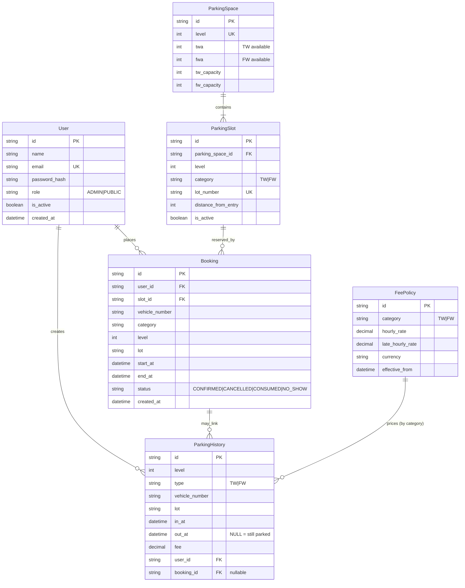
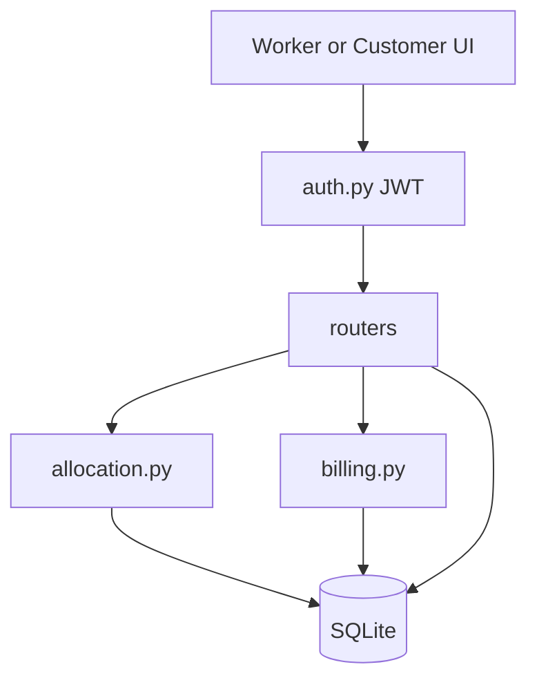
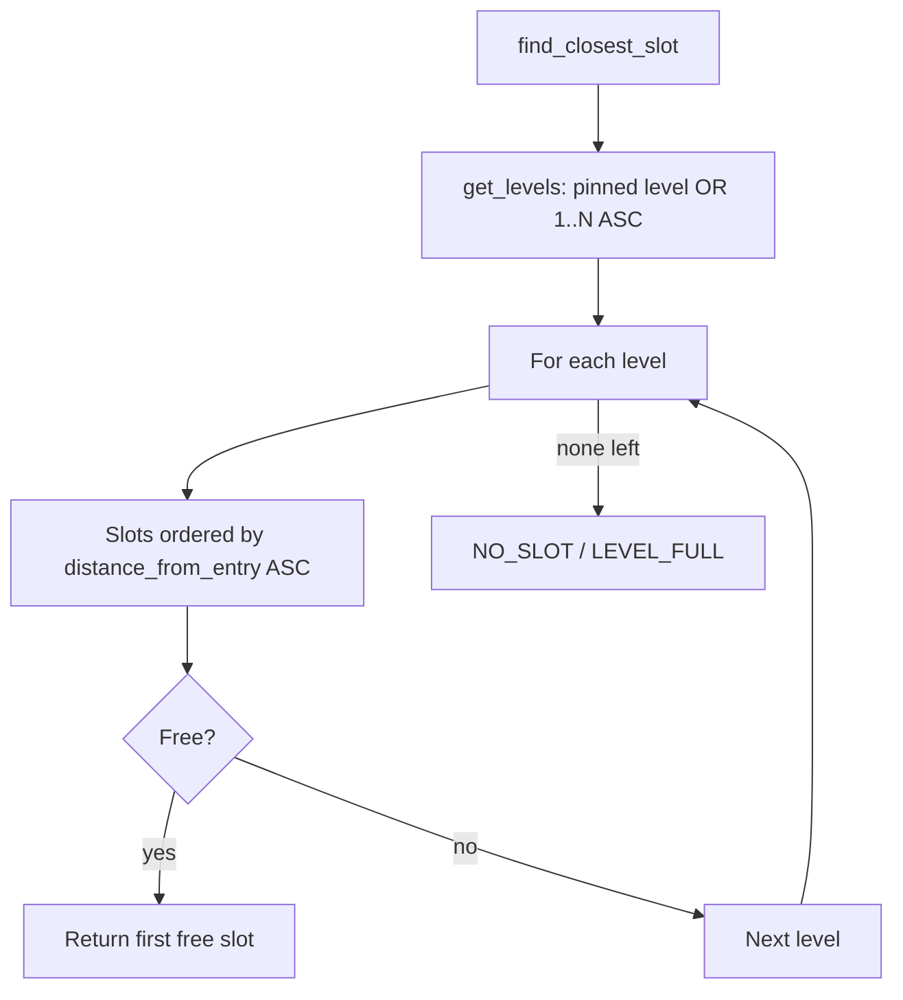
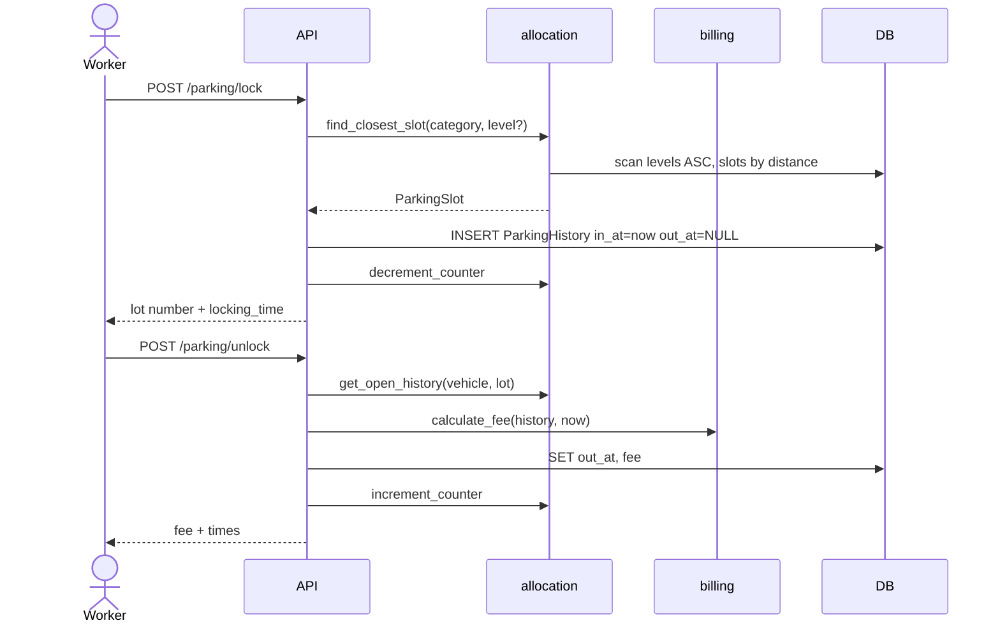
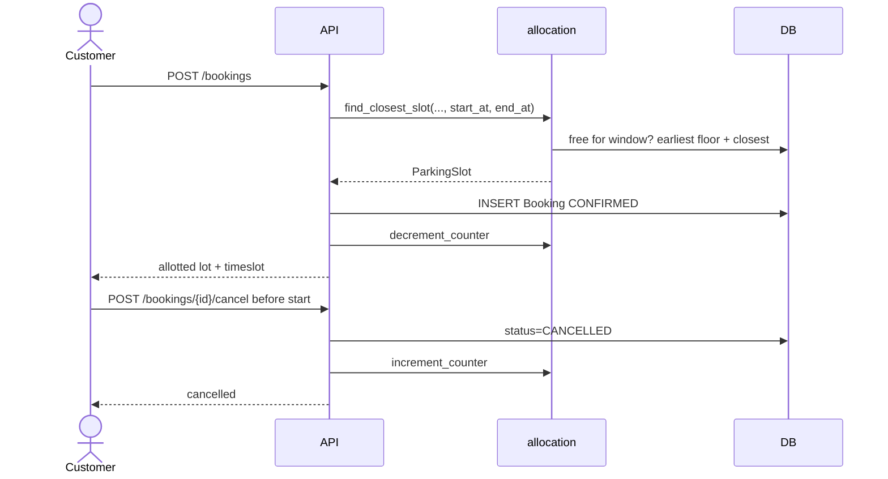

# ER Diagram & Function Reference

Source of truth for the FastAPI parking lot backend: data model relationships and how each major function works.

---

## 1. Entity-Relationship Diagram

### Relationship notes

| From | To | Meaning |
| --- | --- | --- |
| `ParkingSpace` → `ParkingSlot` | 1:N | One floor row owns many physical lots |
| `User` → `ParkingHistory` | 1:N | Who locked / owns the stay |
| `User` → `Booking` | 1:N | Who pre-booked |
| `ParkingSlot` → `Booking` | 1:N | Which lot was reserved |
| `Booking` → `ParkingHistory` | 1:N optional | Walk-in has `booking_id = NULL`; booked stays can link |
| `FeePolicy` | logical | Matched by `category` (`TW`/`FW`), not a hard FK |

### Occupancy rules (business)

- A lot is **occupied** if any `ParkingHistory` row for that `lot` has `out_at IS NULL`.
- A lot is **reserved** if a `Booking` is `CONFIRMED` and `end_at` is still in the future.
- `ParkingSpace.twa` / `fwa` are denormalized **available** counters updated on lock/book/unlock/cancel.

---

## 2. Request flow (high level)

---

## 3. Allocation algorithm

**Rule:** earliest floor first, then closest slot (`distance_from_entry`, then `lot_number`).

---

## 4. API endpoints → functions

| Method | Path | Handler | Core helpers |
| --- | --- | --- | --- |
| `POST` | `/api/v1/auth/register` | `register` | `hash_password`, `create_access_token` |
| `POST` | `/api/v1/auth/login` | `login` | `verify_password`, `create_access_token` |
| `GET` | `/api/v1/auth/me` | `me` | `get_current_user` |
| `GET` | `/api/v1/parking/availability` | `availability` | role-shaped `ParkingSpace` counters |
| `GET` | `/api/v1/parking/spaces` | `list_spaces` | `slot_status` (ADMIN) |
| `POST` | `/api/v1/parking/lock` | `lock_space` | `find_closest_slot`, `decrement_counter` |
| `POST` | `/api/v1/parking/unlock` | `unlock_space` | `get_open_history`, `calculate_fee`, `increment_counter` |
| `POST` | `/api/v1/bookings` | `create_booking` | `find_closest_slot` (window), `decrement_counter` |
| `GET` | `/api/v1/bookings/me` | `my_bookings` | owner filter |
| `GET` | `/api/v1/bookings` | `list_all_bookings` | ADMIN |
| `POST` | `/api/v1/bookings/{id}/cancel` | `cancel_booking` | `increment_counter` |
| `GET` | `/health` | `health` | none |

---

## 5. Function catalog

### 5.1 Auth — `backend/auth.py`

| Function | What it does |
| --- | --- |
| `hash_password` | Hashes plaintext with Argon2 via Passlib. |
| `verify_password` | Checks login password against stored hash. |
| `create_access_token` | Builds JWT with `sub` (user id), `role`, and expiry. |
| `get_current_user` | Reads Bearer token, validates JWT, loads `User` from DB. |
| `require_admin` | Dependency: 403 unless `role == ADMIN`. |

### 5.2 Auth routes — `backend/routers/auth_router.py`

| Function | How it works |
| --- | --- |
| `register` | Always creates `PUBLIC` user (client cannot set ADMIN). Returns JWT. |
| `login` | Email + password → JWT; same error for bad user/password. |
| `me` | Returns current authenticated user profile. |

### 5.3 Allocation — `backend/services/allocation.py`

| Function | How it works |
| --- | --- |
| `vehicle_has_open_stay` | True if vehicle already has history with `out_at IS NULL`. |
| `lot_has_open_stay` | True if lot has an open history row. |
| `_history_overlaps` | True if any history interval overlaps `[start, end)`. Open stay = `[in, +∞)`. |
| `_booking_overlaps` | True if any `CONFIRMED` booking overlaps the window. |
| `is_slot_free_for_window` | Used for **pre-book**: free only if no open stay / history / booking conflict. |
| `is_slot_free_now` | Used for **walk-in lock**: free if no open stay and no confirmed booking still ending in the future. |
| `get_levels` | Returns one level if pinned, else all levels sorted ascending. |
| `find_closest_slot` | Core allocator: scan floors → scan slots by distance → return first free. |
| `decrement_counter` | Decrements `twa` or `fwa` on that level (lock/book). |
| `increment_counter` | Increments counter capped at capacity (unlock/cancel). |
| `get_open_history` | Loads open stay for vehicle+lot (with booking joined). |
| `slot_status` | Returns `OCCUPIED` / `BOOKED` / `FREE` for worker slot map. |

### 5.4 Billing — `backend/services/billing.py`

| Function | How it works |
| --- | --- |
| `hours_billed` | `ceil(seconds/3600)`, minimum **1** hour. |
| `get_fee_policy` | Latest `FeePolicy` row for category (`TW`/`FW`). |
| `calculate_fee` | **Walk-in:** hours × hourly rate from `in_at`→`out_at`. **Booked:** base = booked window × rate; if checkout after `end_at`, add late hours × `late_hourly_rate`. |

### 5.5 Parking routes — `backend/routers/parking_router.py`

| Function | How it works |
| --- | --- |
| `availability` | ADMIN → integer counts per level; PUBLIC → booleans only (no lot numbers). |
| `list_spaces` | ADMIN: every slot + `slot_status` + vehicle if occupied. |
| `lock_space` | ADMIN walk-in: reject if vehicle already parked → `find_closest_slot` → insert `ParkingHistory` (`out_at=NULL`) → decrement counter. |
| `unlock_space` | ADMIN or owner: find open history → `calculate_fee` → set `out_at`/`fee` → increment counter → mark booking `CONSUMED` if linked. |

### 5.6 Booking routes — `backend/routers/booking_router.py`

| Function | How it works |
| --- | --- |
| `create_booking` | Validates future window (min 30m, max 7 days ahead) → `find_closest_slot` for timeslot → create `CONFIRMED` booking → decrement counter. |
| `my_bookings` | Lists bookings for current user. |
| `list_all_bookings` | ADMIN list of all bookings. |
| `cancel_booking` | Owner/ADMIN; only if `CONFIRMED` and `now < start_at` → `CANCELLED` → increment counter. |

### 5.7 Seed — `backend/seed.py`

| Function | How it works |
| --- | --- |
| `seed_all` | Idempotent: admin user + fee policies + levels/slots. |
| `_seed_admin` | Creates ADMIN from env if missing. |
| `_seed_fee_policies` | TW/FW rates from settings. |
| `_seed_parking` | Creates `ParkingSpace` + `ParkingSlot` rows (`{level}-{TW\|FW}-{seq:03d}`). |

### 5.8 Database — `backend/database.py`

| Function | How it works |
| --- | --- |
| `set_sqlite_pragma` | Enables WAL + foreign keys on connect. |
| `get_db` | FastAPI dependency yielding a SQLAlchemy session. |
| `init_db` | `create_all` for ORM tables. |

---

## 6. Lock / unlock sequence

---

## 7. Pre-book sequence

---

## 8. Frontend mapping

| UI | Calls |
| --- | --- |
| Worker dashboard | `availability`, `spaces`, `lock`, `unlock` |
| Customer dashboard | `availability` (booleans), `bookings`, `bookings/me`, cancel |
| Login / Register | `auth/login`, `auth/register` |

Allocation rule shown to users: **closest free slot on the earliest available floor at commit time** (snapshot; no later rebalancing).
